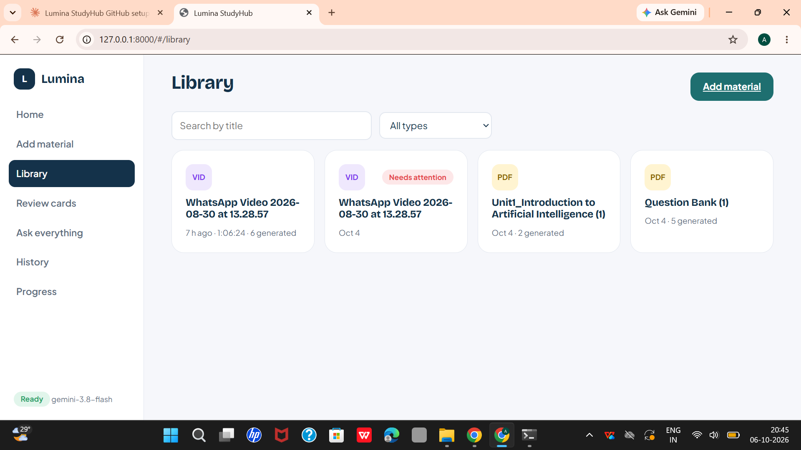
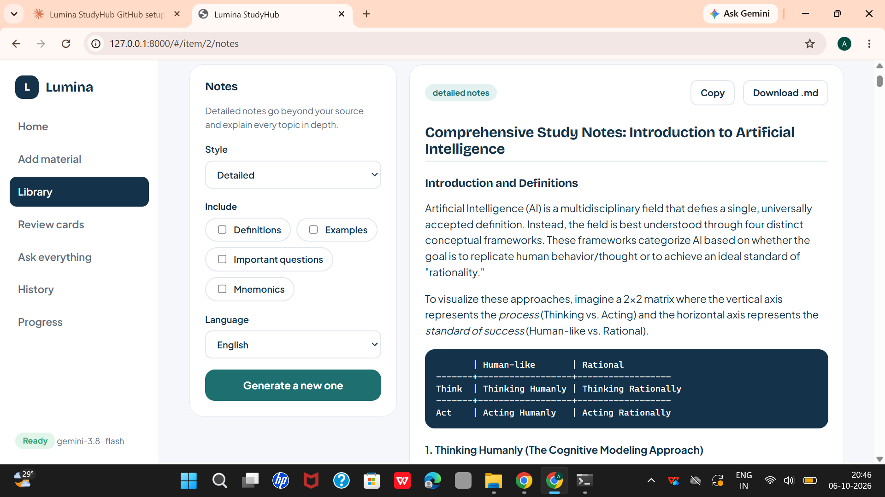
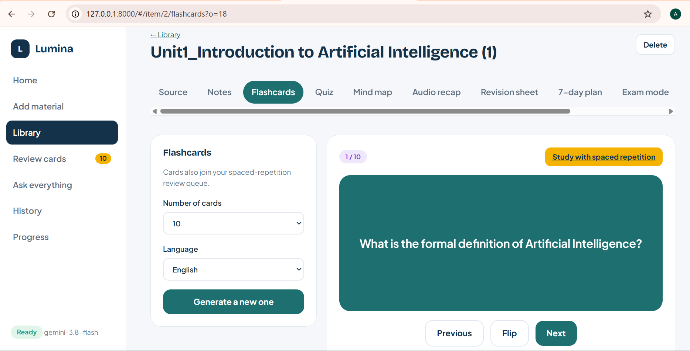

# Lumina StudyHub

AI study assistant. Upload a lecture video, audio, PDF, photo of notes or text file, and get notes, flashcards, quizzes, mind maps, and an AI tutor that answers from your own material and shows where each answer came from.






## Features

- Notes, flashcards, quizzes, mind maps, audio recap, revision sheet, 7-day plan, exam bundle and concept map
- Hindi/English transcription with noise reduction
- AI tutor with page/timestamp citations and a confidence score
- SM-2 spaced repetition
- Handles long lectures (up to 6 hours) with chunking, background processing and resume
- Progress tracking, streaks and achievements

## Tech stack

Python, FastAPI, JavaScript, SQLite, faster-whisper, PyMuPDF, ffmpeg, Gemini API

## Set up (Windows, about 10 minutes)

1. **Python 3.10+** must be installed (check with `python --version`).
2. **ffmpeg** is needed for audio/video. In a terminal run: `winget install Gyan.FFmpeg`, then close and reopen the terminal.
3. **Free AI key**: open https://aistudio.google.com/apikey, create a key.
4. In this folder, copy `.env.example` to `.env` and paste the key after `GEMINI_API_KEY=`.
5. Double-click `start_studyhub.bat` (first run installs everything and takes a few minutes).
   Or manually:
```
   python -m venv .lumina_env
   .lumina_env\Scripts\activate
   pip install -r requirements.txt
   python launch.py
```
6. The browser opens at http://127.0.0.1:8000.

## How it works

```
upload -> ffmpeg noise reduction -> faster-whisper (Hindi/English) -> segments with timestamps
PDF/image -> PyMuPDF text per page (scanned pages read by Gemini) -> pages
          -> chunks (page / timestamp kept) -> Gemini embeddings -> SQLite
question  -> key-facts layer + hybrid search (embeddings 80% + keywords 20%) -> grounded answer
          -> sources (page or timestamp), confidence score
```

| Feature | Where in the code |
|---|---|
| Noise reduction + Hindi/English transcription | `server/ears.py` |
| PDF page tracking, OCR for scans | `server/pagereader.py` |
| Chunking + map-reduce for huge files | `server/chunker.py` |
| RAG retrieval + confidence | `server/finder.py` |
| Chat modes, curated key facts, citations | `server/tutor.py` |
| All generators (notes, quiz, mind map...) | `server/recipes.py` |
| SM-2 spaced repetition | `server/spaced.py` |
| Rate-limit retry, JSON repair | `server/gemini_client.py` |
| Progress, streak, achievements | `server/insights.py` |
| API | `server/webapp.py` |
| UI | `web/` |

**Speed on long files:** audio is transcribed once in the background (silence is skipped), results are saved,
and a 6-hour lecture is condensed block by block (map-reduce) so no AI request ever exceeds the context limit.
Transcribing long media on a CPU takes real time: use `WHISPER_MODEL=base` for speed, `medium` on a GPU for accuracy.

## Long videos (how they are processed)

```
video -> ffprobe (length, has audio?) -> extract audio ONCE (fast, real progress) -> cut into ~8 min parts at quiet moments
      -> transcribe part by part -> every finished part is saved to the database immediately
```

- **Hybrid engine.** `auto`: up to 5 minutes is transcribed on this computer; longer lectures go to **Gemini**, several parts
  at once (a 2-hour lecture is about 15 parts). You can force either one on the Add material page or in `.env`.
- **Noise reduction** is only applied automatically to short clips. The old filter chain (`loudnorm` + `afftdn`) was the
  main reason for the long "Reducing background noise" wait; long lectures now skip it.
- **Real progress and a measured ETA** (from the speed of finished parts). No fake bar.
- **Background job.** Close the page whenever you like. The job runs inside the app, so keep the app window open and the
  laptop awake. A badge on Library, the tab title, and a notice tell you when it is done.
- **Resume.** If something fails or the app is closed, press Resume: finished parts are kept and only the missing ones are
  redone. After a Gemini failure you can resume on this computer, and the other way round.
- **Cached forever.** The transcript is stored once. Notes, flashcards, quizzes and everything else read it from the
  database and never transcribe again.
- **Limits that matter.** Gemini reads audio at 32 tokens per second (a 2-hour lecture is about 230,000 input tokens) and
  inline requests are capped at 20 MB, which is why audio is sent in ~8 minute parts. Free keys have per-minute and daily
  limits; if they are hit, the app waits, retries, tries backup models, and otherwise tells you which parts are saved.
  Audio sent to Gemini leaves your computer; use `local` for private material.

## Why generation is fast

- **Notes** are planned first (4-12 sections depending on length), then every section is written at the same time
  (`GEMINI_PARALLEL`). Quality is the same or better: each section gets its own full-depth write-up.
- **Thinking level**: Gemini 3.x "thinks" deeply by default, which can add minutes to long writing. Notes and the
  long-document condenser use a lower thinking level. Other features are unchanged.
- **Long documents** (about 40+ pages) are condensed once during upload, with a visible "Condensing long document (3/12)"
  step, and cached. After that every feature reuses it. Two requests never repeat the same condensing work.
- **Scanned PDF pages** are read by the AI several at a time instead of one by one.
- **Live progress**: generation shows the real stage ("Planning the sections", "Writing sections (3/6)") and elapsed time.

## Troubleshooting

- **"Setup needed" in the sidebar**: key missing in `.env` or ffmpeg not installed.
- **"Model not found"**: change `GEMINI_MODEL` / `GEMINI_EMBED_MODEL` in `.env` to current names from Google AI Studio.
- **Rate limit messages**: the app retries automatically; free keys have per-minute limits. Wait a minute.
- **Hindi audio recognised as English (or the reverse)**: choose the language on the Add material page.
- **Audio recap silent for Hindi**: install a Hindi voice in Windows Settings > Time & language > Speech.
